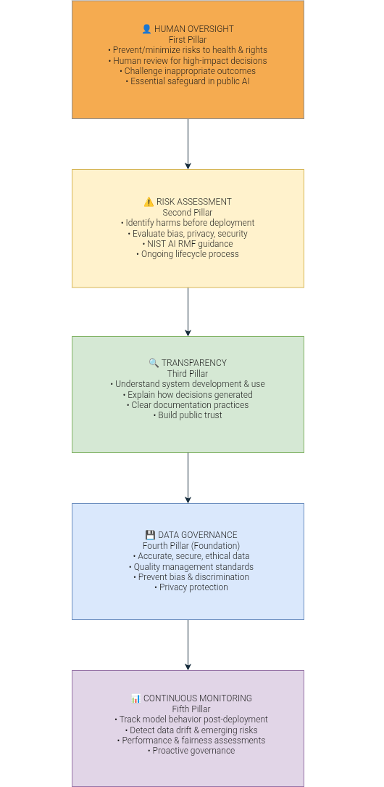

# 🛡️ AI Governance Framework for Responsible AI Adoption in Public Systems

  <h3>Project 3 | Independent AI Governance Researcher</h3>
  
A comprehensive 5-pillar governance framework for responsible AI deployment in public-sector environments

  

---

## 🎯 Project Overview

This research proposes a **comprehensive 5-pillar governance framework** for responsible AI adoption in public-sector environments, addressing critical challenges like bias, privacy violations, lack of transparency, accountability gaps, and cybersecurity threats in government AI systems.

**Why this matters**: AI is increasingly deployed in healthcare, welfare, education, law enforcement, and public administration. Biased algorithms, privacy violations, and opaque decision-making can harm citizens—especially marginalized communities. Effective governance ensures AI systems remain trustworthy, inclusive, and aligned with public interests.

---

## 🚀 Key Contributions

### 1️⃣ Risk Analysis: 5 Critical Challenges in Public AI
| Risk | Impact | Real Example |
|------|--------|--------------|
| **Bias & Discrimination** | Systemic unfairness | UK welfare AI: only 35% accuracy, 65% required human correction |
| **Privacy & Data Protection** | 160+ US agencies using algorithmic systems | Sensitive citizen data at risk |
| **Transparency & Explainability** | Citizens can't understand decisions | UK government faced contempt of court over AI transparency |
| **Accountability** | unclear responsibility chains | Who's liable when AI makes harmful decisions? |
| **Cybersecurity** | $1.28B deepfake fraud losses (2025) | 50% of businesses victimized in 2024 |

### 2️⃣ Comparative Analysis: 4 International Governance Approaches

| Framework | Country/Region | Key Feature |
|-----------|---------------|-------------|
| **EU AI Act** | 🇪🇺 European Union | World's first comprehensive AI law, risk-based approach (unacceptable/high/limited/minimal) |
| **OECD AI Principles** | 🌍 International (50+ countries) | 5 values for trustworthy AI, adopted 2019 (first internationally recognized) |
| **Responsible AI for All** | 🇮🇳 India (NITI Aayog) | Principle-based approach, no dedicated AI statute yet, focuses on "AI for All" |
| **Society 5.0** | 🇯🇵 Japan | Human-centered AI, technology enhances human capabilities (not replaces) |

### 3️⃣ Proposed 5-Pillar Governance Framework

┌─────────────────────────────────────┐

│  👤 HUMAN OVERSIGHT                 │  ← Prevent/minimize risks to health & rights
│  First Pillar                        │  ← Human review for high-impact decisions
├─────────────────────────────────────┤

│  ⚠️ RISK ASSESSMENT                  │  ← Identify harms before deployment
│  Second Pillar                       │  ← Evaluate bias, privacy, security
├─────────────────────────────────────┤

│  🔍 TRANSPARENCY                     │  ← Explain how decisions generated
│  Third Pillar                        │  ← Build public trust
├─────────────────────────────────────┤

│  💾 DATA GOVERNANCE                  │  ← Foundation: accurate, secure, ethical data
│  Fourth Pillar (Foundation)          │  ← Quality management, prevent bias
├─────────────────────────────────────┤

│  📊 CONTINUOUS MONITORING            │  ← Track model behavior post-deployment
│  Fifth Pillar                        │  ← Detect data drift, proactive governance
└─────────────────────────────────────┘

**Framework draws from**: EU AI Act, OECD Principles, NIST AI RMF, ISO/IEC 42001, UNESCO Ethics

**Target outcomes**: Public Trust ✓ | Accountability ✓ | Security ✓ | Balanced Innovation ✓ | Fundamental Rights ✓

### 4️⃣ Practical Implementation Roadmap
- **4 actionable steps**: Establish policies → Develop risk assessment → Implement transparency → Continuous monitoring
- **Risk assessment checklist** included (see `framework/implementation-checklist.md`)

---

## 📊 Framework Architecture

The framework integrates common principles from international governance initiatives into 5 interconnected pillars:

| Pillar | Primary Purpose | Key Standards Reference |
|--------|---------------|------------------------|
| **Human Oversight** | Prevent risks to health & fundamental rights | EU AI Act (human oversight requirement for high-risk AI) |
| **Risk Assessment** | Proactive harm identification | NIST AI RMF, ISO/IEC 42001 |
| **Transparency** | Build trust through explainability | EU AI Act (transparency obligations) |
| **Data Governance** | Foundation: ensure data quality & ethics | ISO/IEC 42001, India's DPPA 2023 |
| **Continuous Monitoring** | Proactive governance post-deployment | NIST AI RMF (ongoing evaluation) |

📁 **Visual diagram**: See [`framework/framework-diagram.png`](framework/framework-diagram.png)

---

## 🌍 Why This Matters: Real-World Impact

### Case Study 1: UK Welfare Fraud AI (2024)
- **Problem**: AI system exhibited bias based on age, disability, marital status, nationality
- **Impact**: Only **35% accuracy**, **65% required human correction**
- **Scale**: Wrongly flagged **200,000+ housing benefit claims** (2/3 were legitimate)
- **Vulnerable groups affected**: Disabled people, older adults, foreigners
- **Source**: The Guardian (2024) [web:1][web:4][web:10]

### Case Study 2: US Healthcare Algorithm Racial Bias (2019)
- **Problem**: Algorithm used by US hospitals to predict health risk
- **Impact**: Reduced Black patient identification for extra care by **>50%**
- **Scale**: Affected **200 million Americans annually**
- **Bias mechanism**: Used health expenditure as metric (Black patients spend less due to systemic barriers)
- **Correction**: When fixed, Black patient identification increased from 17.7% to 46.5%
- **Source**: Science journal (2019) [web:11][web:14][web:19]

### Case Study 3: Deepfake Fraud Crisis (2024-2025)
- **2024 losses**: $360 million
- **2025 losses**: **$1.28 billion** (tripled in one year) [web:18]
- **Business impact**: **50% of businesses** victimized in 2024, average $450K per incident [web:16]
- **Scale**: 1,567 verified deepfake incidents, 296 billion media impressions [web:18]
- **Global disinformation cost**: $78 billion yearly [web:16]

### India Context: Unique Challenges
- **Current approach**: No dedicated AI statute; principle-based governance via NITI Aayog
- **Recent regulation**: Digital Personal Data Protection Act (2023) provides foundational privacy
- **Vision**: "Responsible AI for All" - leverage AI for economic growth, social inclusion, public welfare
- **Key challenges**:
  - Varying digital literacy across large, diverse population
  - Dataset bias underrepresenting marginalized communities (tribal populations, rural women, disabled citizens)
  - Limited access to advanced computing infrastructure
  - Complex accountability among developers, deployers, government agencies, users

---

## 📁 Repository Structure

ai-governance-public-systems-framework/
├── README.md                    ← Main showcase file
├── paper/
│   ├── research-paper.md        ← Full research paper
│   └── research-paper.pdf       ← PDF version
├── framework/
│   ├── framework-diagram.png    ← Visual diagram
│   └── implementation-checklist.md  ← Risk assessment tool
├── research-notes/
│   ├── outline.md               ← Paper structure
│   └── references.md            ← Complete references
└── drafts/
└── draft.md                 ← Working draft

---

## 🔬 Research Methodology

### Data Sources
- **Official documents**: EU Parliament, OECD, NITI Aayog, NIST, ISO, UNESCO, UN High-Level Advisory Body
- **Case studies**: UK DWP (2024), US Optum healthcare (2019), deepfake fraud reports (2024-2025)
- **Statistics**: KPMG, Surfshark, Resemble AI, World Economic Forum

### Analysis Framework
1. **Risk identification**: Categorized 5 key risks in public AI adoption
2. **Comparative review**: Analyzed 4 international governance approaches (EU, OECD, India, Japan)
3. **Framework synthesis**: Integrated common principles into unified 5-pillar model
4. **Practical application**: Created implementation roadmap + risk assessment checklist

---

## 🛠️ How to Use This Framework

### For Organizations Implementing AI in Public Sector

**Step 1: Establish Governance Policies**
- Define ethical principles, governance objectives, operational guidelines
- Align with legal requirements and public interests
- Establish governance committee/oversight body

**Step 2: Develop Risk Assessment Mechanisms**
- Use checklist in `framework/implementation-checklist.md`
- Assess proportional to impact (higher risk = more rigorous evaluation)
- Key risks: bias, privacy, transparency, accountability, cybersecurity
- Treat as ongoing process, not one-time activity

**Step 3: Implement Transparency & Accountability Measures**
- Disclose when AI is used
- Provide understandable decision explanations
- Maintain comprehensive documentation (design, data sources, limitations)
- Clearly identify responsible individuals/departments

**Step 4: Continuous Monitoring & Improvement**
- Track performance, accuracy, fairness, security post-deployment
- Detect model drift, declining performance, unintended bias
- Conduct regular audits + collect user feedback
- Move from reactive to proactive governance

### For Researchers & Policymakers

- Use framework as baseline for AI governance research
- Extend with sector-specific applications (healthcare, education, law enforcement, welfare)
- Compare with emerging frameworks (NIST AI RMF updates, EU AI Act implementation guidelines)
- Adapt for country-specific contexts (India's diverse population, digital literacy gaps)

---

## 📊 Key Statistics Summary

| Metric | Value | Source |
|--------|-------|--------|
| UK Welfare AI accuracy | 35% (65% human correction) | The Guardian 2024 |
| Housing benefits wrongly flagged | 200,000+ claims (2/3 legitimate) | Incident Database |
| US healthcare algorithm affected | 200 million Americans/year | Science 2019 |
| Black patients under-identified | >50% reduction (corrected: 46.5%) | Science 2019 |
| Deepfake fraud losses (2025) | $1.28 billion | Resemble AI 2026 |
| Businesses deepfake victimized (2024) | 50%, avg. $450K/incident | WEF 2025 |
| US agencies using algorithmic AI | 160+ public agencies | Blunt Policy 2025 |
| Global disinformation cost | $78 billion/year | WEF 2025 |

📁 **Full statistics & sources**: See `research-notes/references.md`

---

## 🔗 References

### Primary Governance Frameworks
1. **EU AI Act**: European Parliament (2024) - [artificialintelligenceact.eu](https://artificialintelligenceact.eu/)
2. **OECD AI Principles**: OECD (2019) - [oecd.ai](https://oecd.ai/en/ai-principles)
3. **India's Responsible AI**: NITI Aayog (2021) - [niti.gov.in](https://www.niti.gov.in/)
4. **Japan Society 5.0**: Government of Japan (2019) - [cao.go.jp](https://www8.cao.go.jp/cstp/english/society5_0/)
5. **NIST AI RMF**: NIST (2023) - [nist.gov](https://www.nist.gov/itl/ai-risk-management-framework)
6. **ISO/IEC 42001**: ISO (2023) - [iso.org](https://www.iso.org/)
7. **UNESCO Ethics**: UNESCO (2021) - [unesco.org](https://www.unesco.org/en/artificial-intelligence/recommendation-ethics)
8. **UN High-Level Report**: United Nations (2024) - [un.org](https://www.un.org/)

### Case Studies & Statistics
- UK Welfare AI bias: The Guardian (2024) [web:1][web:4]
- UK AI transparency controversy: The Guardian (2023) [web:7]
- US Healthcare algorithm bias: Science journal (2019) [web:11][web:14][web:19]
- Deepfake fraud: Resemble AI (2026) [web:18], Surfshark (2025) [web:13]
- Public sector algorithms: Blunt Policy (2025) [web:3]
- Disinformation economics: World Economic Forum (2025) [web:16]

📁 **Complete references**: See `research-notes/references.md`

---

## 👤 About the Author

**Riya Soy** | Independent AI Governance Researcher  
📍 Jamshedpur, Jharkhand, India  
🎓 B.Tech Mechatronics Engineering (2021), Banasthali Vidhyapith 

**Focus Areas**: AI in public systems, technology policy, AI governance frameworks, responsible AI  

**Research Interests**:  
- AI governance in public sector (healthcare, welfare, education, law enforcement)  
- Algorithmic bias & fairness in machine learning systems  
- International AI policy comparison (EU, OECD, India, Japan)  
- Building trustworthy, accountable, human-centered AI  

**Professional Goal**: AI/ML Engineer or AI/ML Researcher role | Exploring fully funded scholarships abroad (Japan, South Korea, Taiwan, Singapore)  

---

## 📚 My Research Portfolio

### Project 1: AI Governance in Public Systems
🔗 [GitHub Repository](https://github.com/riyasoy/ai-governance-public-systems)  
📄 Focus: Comprehensive analysis of AI adoption challenges in public sectors, reviewing international governance frameworks (EU AI Act, OECD Principles, India's NITI Aayog), proposing governance recommendations for responsible AI implementation.

### Project 2: AI in Cybersecurity: Threat Detection, Security Operations, and Emerging Risks
🔗 [GitHub Repository](https://github.com/riyasoy/ai-cybersecurity-research)  
📄 Focus: Examining AI's dual role in cybersecurity—enhancing threat detection while introducing new attack vectors. Covers security operations automation, adversarial ML, and emerging risks from generative AI.

### Project 3: AI Governance Framework for Responsible AI Adoption in Public Systems ← **Current**
🔗 [GitHub Repository](https://github.com/riyasoy/ai-governance-public-systems-framework)  
📄 Focus: This research proposes a practical 5-pillar governance framework (Human Oversight → Risk Assessment → Transparency → Data Governance → Continuous Monitoring) with implementation roadmap and risk assessment checklist for public-sector AI deployment.

---

## 📮 Connect & Collaborate

💼 **LinkedIn**: [Riya Soy](https://www.linkedin.com/in/riya-soy-61ab92179/)  
🐙 **GitHub**: [riyasoy](https://github.com/riyasoy)  
📧 **Email**: [riyasoy221@gmail.com / riya.soy.official@gmail.com]

---

## 🙏 Acknowledgments

This framework synthesizes principles from:
- **EU AI Act** (risk-based classification, human oversight requirements)
- **OECD AI Principles** (5 values for trustworthy AI)
- **NIST AI Risk Management Framework** (proactive risk identification)
- **ISO/IEC 42001** (AI management system standards)
- **UNESCO Recommendation on Ethics of AI** (human-centered approach)
- **UN High-Level Advisory Body on AI** (governing AI for humanity)

Special thanks to open-source research communities and policy researchers making governance frameworks accessible.

---

## 📄 License

This research is licensed under the **MIT License**. Feel free to use, modify, and share for educational and research purposes. Please cite appropriately when referencing.

---

## 📮 Feedback & Contributions

Welcome! Please open an issue or submit a pull request for:
- ✅ Bug fixes or corrections in the research paper
- ✅ Additional case studies (sector-specific: healthcare, education, law enforcement, welfare)
- ✅ Framework improvements or extensions
- ✅ Country-specific adaptations (especially for India's diverse context)
- ✅ Implementation examples or tool prototypes

---

  
<strong>Building trustworthy, accountable, and human-centered AI systems for the public sector</strong>

  
Research Project 3 | AI Governance | June 2026

  
Independent Researcher | Jamshedpur, Jharkhand, India

